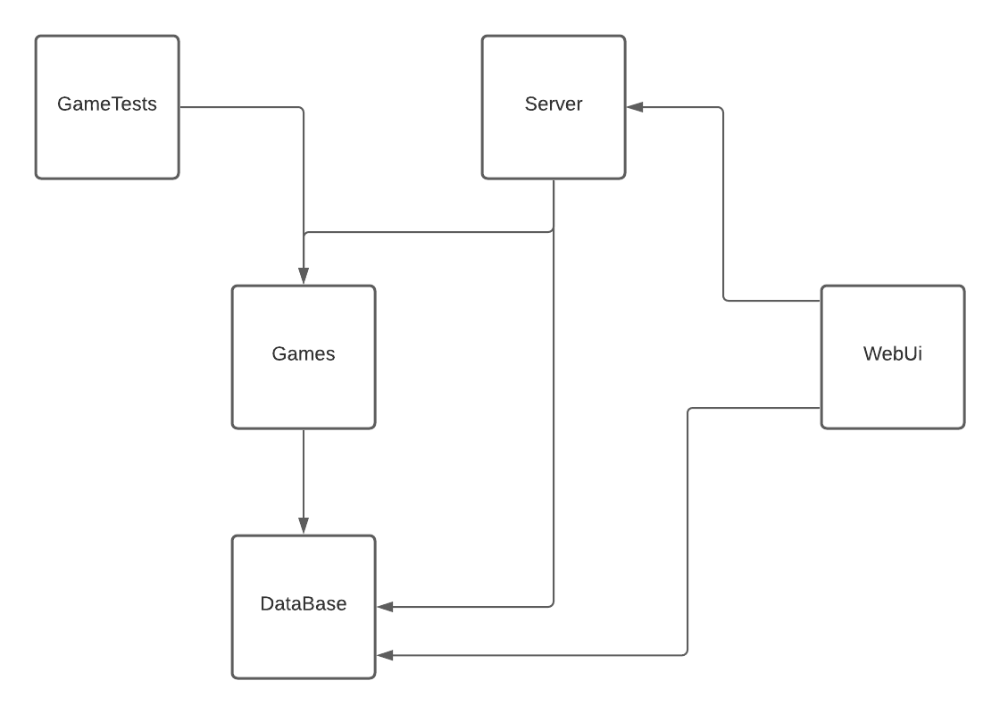

# Проект игрового бота в телеграмме

 Цель проекта:  __Построение правильной архитектуры приложения__ для легкой расширяемости, обновления и поддержки.

 # Структура проекта

## Основные зависимости проектов
 

## Структура проекта DataBase
 

 ## Структура проекта Games
 

 ## Структура проекта Server
 